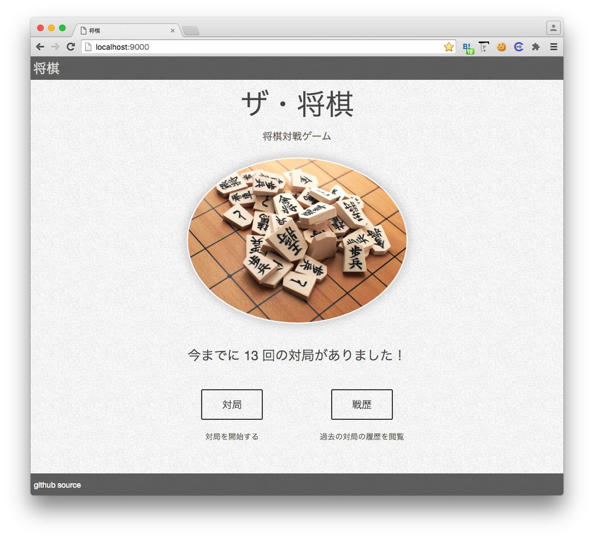
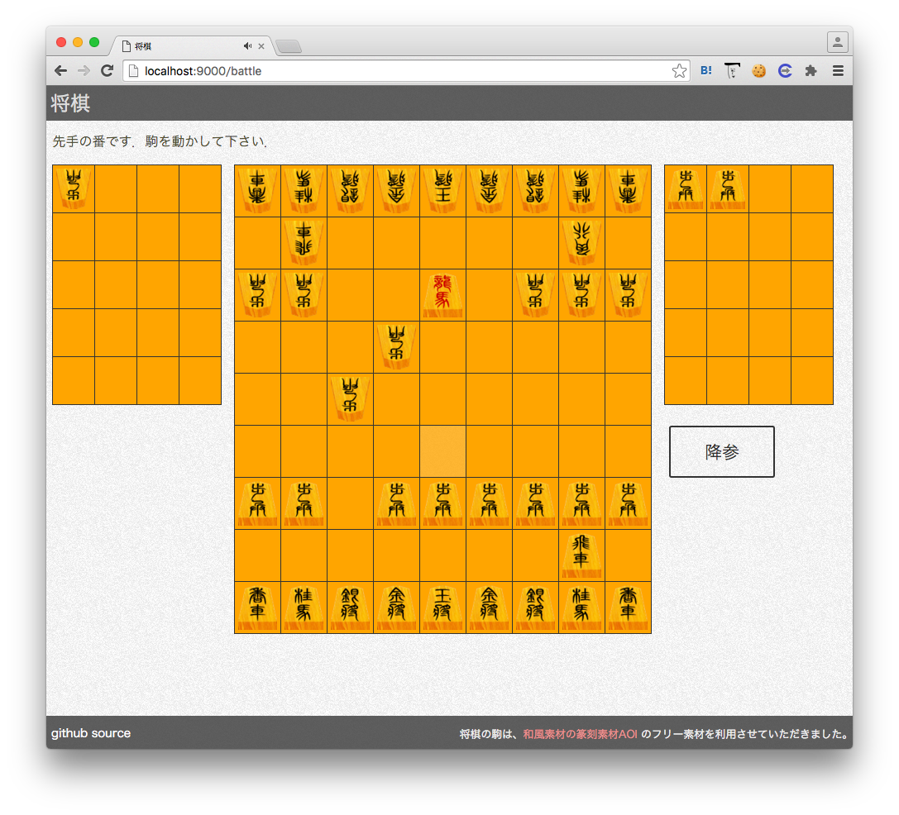
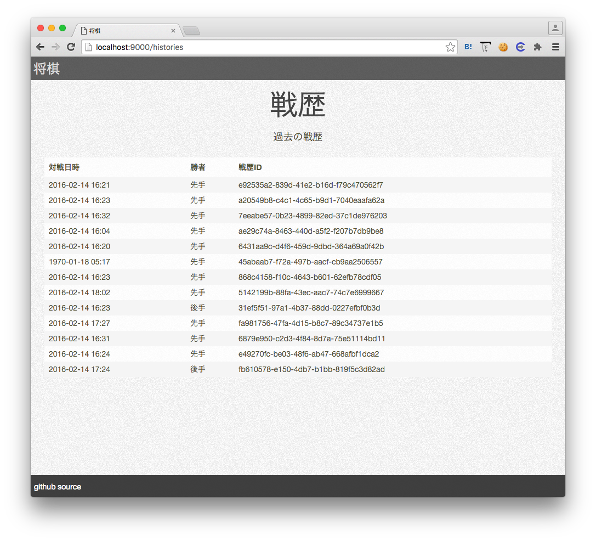

# syougi-web

[demo](http://takuan.me:9000/)







## project structure

layered architecture

```
─── app
    ├── controllers
    ├── domains
    │   ├── lifecycle
    │   ├── models
    │   └── support
    ├── infrastructures
    └── views
```

## how to launch

```bash
$ git clone git@github.com:oshiro-kazuma/syougi-web.git
$ cd syougi-web
$ sbt run
$ open http://localhost:9000
```

## link
[frontend only syougi.js](https://github.com/oshiro-kazuma/syougi.js)
